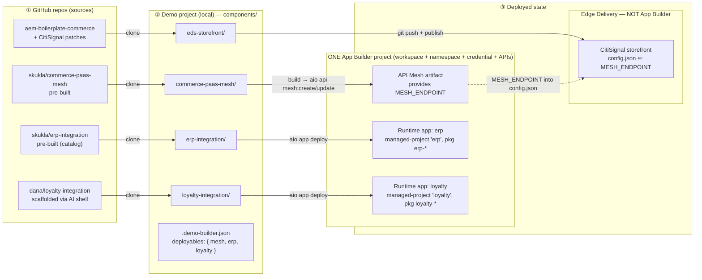

# Plan: App Builder deployable model (Model B) — overview

**Status:** Design accepted (Model B). **D1 spike DONE** (all 5 questions answered live — see
`../../research/appbuilder-deployable-model/d1-spike-findings.md`). **D1 PLANNED (TDD-ready)** —
step files `step-00.md`…`step-09.md` below; awaiting PM review before TDD. D2–D6 still pending.
**Decision record:** [ADR-011 App Builder Deployables](../../../docs/architecture/adr/011-app-builder-deployables.md).
**Research base:** [`../../research/appbuilder-deployable-model/research.md`](../../research/appbuilder-deployable-model/research.md)
(+ [`../../research/app-builder-app-structure/research.md`](../../research/app-builder-app-structure/research.md)).
**Supersedes:** the slice-1-as-shipped singular model and reshapes the slice specs
`.rptc/backlog/2026-06-17-appbuilder-app-*.md` around a unified deployable.

## The idea in one line

A demo's workspace holds a **list of deployables** — a mesh, zero or more integrations — each picked
from a catalog, each cloned/deployed into the same workspace. **Mesh is just one kind of deployable.**

## The unit: a "deployable"

One concept replaces today's two special cases (singular `meshState` + singular `appState`):

Every deployable is a **codebase** that lives inside the demo's one App Builder project (workspace).
A mesh is App-Builder-template-shaped code (the three mesh repos), not mere config — the workspace
"has a mesh" because the **API Mesh API is subscribed on the project**.

- `kind`: `"mesh" | "integration"`.
  - **mesh** — a codebase built + deployed via `aio api-mesh:create/update`; requires the **API Mesh
    API** on the workspace; **provides env vars the storefront consumes** (today's `MESH_ENDPOINT` →
    `config.json` edge), generalized so any deployable *may* declare `providesEnvVars`.
  - **integration** — a custom app codebase deployed via idempotent `aio app deploy`; stands alone;
    *may* read another deployable's provided vars (e.g. an integration that calls the mesh); may
    require its own Adobe product APIs subscribed.
- **Each deployable declares the Adobe APIs it needs** (`requiredApis`); adding it must ensure those
  are subscribed on the workspace (`subscribeCredentialToServices` — currently UNBUILT; only the bare
  S2S credential is created today, so the mesh path assumes the API Mesh API is already present).
- **State becomes keyed**, not two singletons: `project.deployables: Record<id, DeployableState>`
  (`{ kind, status, source, endpoint?/url?, deployedUrls?, sourceHash?, lastDeployed }`). The mesh's
  endpoint + staleness fields live here too. `meshState`/`appState` collapse into this (migration
  below).
- **Three ways to acquire one:** pre-built (catalog), custom URL (paste a repo), AI shell (scaffold +
  author). All land as a `DeployableState` with a `source`.

## Local components vs. the one App Builder project (the structure)

Two layers that must not be conflated:

Each deployable is its **own** cloned component (its own repo/folder/deploy) — they are NOT bundled
into one app. They all deploy into the one shared App Builder project.

```
LOCAL — what we clone (components/)              CLOUD — one per demo
──────────────────────────────────────          ─────────────────────────────────
components/
  eds-storefront/      ──▶ GitHub + Edge Delivery   (NOT App Builder)
  commerce-paas-mesh/  ──aio api-mesh────────┐
  erp-integration/     ──aio app deploy──────┤   (distinct app + package names)
  loyalty-integration/ ──aio app deploy──────┤
                                   ▼
                                   ┌──────────────────────────────────┐
                                   │  ONE App Builder project          │
                                   │  (Console project + workspace +   │
                                   │   namespace + credential +        │
                                   │   subscribed APIs — provisioned   │
                                   │   ONCE at project setup)          │
                                   │   • API Mesh    ← the mesh         │
                                   │   • Runtime app  ← erp             │
                                   │   • Runtime app  ← loyalty         │
                                   └──────────────────────────────────┘
```

- **A component** = a *local cloned source* (a repo) in `components/<id>/` — git source, folder, build,
  deploy target. Mesh, each integration, storefront are all components.
- **The App Builder project** = *one cloud context per demo* (Console project + workspace + namespace +
  credential + subscribed APIs), provisioned ONCE. It is **not** a component. **There is never a
  separate App Builder project for the mesh vs. integrations** — one project holds them all.
- **Relationship:** every App Builder component deploys INTO the one project, **independently**. Mesh →
  API Mesh artifact (`aio api-mesh`); each integration → its own managed app (`aio app deploy`). Safe
  to coexist because each app carries a distinct managed-project name + package prefix, so a deploy
  prunes only its own entities (verify in the D1 spike).
- **Why each-its-own-component (not one bundled app):** matches our existing one-repo-one-component
  model; gives **independent add/deploy/remove** (removing one integration undeploys just it, no
  recompose/redeploy of the others — the Model B "pieces on a shelf" UX); and eliminates any
  manifest-merge/package-contribution mechanism. Adobe's "one multi-package app" guidance is about
  organizing *one logical app's* domains, not a ban on multiple independent apps in a workspace.

**Rule: one App Builder project per demo; many independent components target it; component count ≠
project count (always 1).** Three picked deployables = three components, three independent deploys,
still ONE project.

**D1 spike (now just a coexistence check, not a merge mechanism):** deploy two small independent apps
into one workspace and confirm (a) the second deploy does NOT prune the first (per-managed-project
isolation in our `aio` version), and (b) a per-integration package-name prefix prevents collisions.

## Lifecycle: add / deploy / remove (the operational spec)

They are NOT compiled into a single *app* — each deploys independently into the single *project*
(workspace). State is keyed: `project.deployables[id] = { kind, status, source, endpoint?/url?,
sourceHash, lastDeployed }`. In the cloud, each integration's entities are tagged with its own
managed-project name + package prefix so deploy/undeploy is individually scoped.

**Add a deployable:**
1. Ensure the one App Builder project exists + the deployable's `requiredApis` are subscribed on the
   workspace (mesh → API Mesh API; integration → its product APIs). *(= the unbuilt
   `subscribeCredentialToServices`, now D1 critical path.)*
2. Clone → `components/<id>/`.
3. Build via shared `buildComponent`.
4. Deploy under `withOrgContext(workspace)` + `exclusive:'adobe-cli'`: mesh → `aio api-mesh:create`;
   integration → `aio app deploy` from its folder with its own managed-project name + package prefix.
5. Record `project.deployables[id]`; if it `providesEnvVars` (mesh → `MESH_ENDPOINT`), regenerate +
   republish the storefront config.

**Deploy / redeploy:** each deployable deploys independently; redeploying one re-runs only its own
deploy (mesh = api-mesh create/update; integration = its managed-project's `app deploy`) and touches
only its own entities. Ordering: a mesh-consuming integration deploys after the mesh.

**Remove:**
- integration → `aio app undeploy` from its folder (removes only that managed-project's
  packages/actions; mesh + other integrations untouched) → clear `project.deployables[id]` → delete the
  local folder.
- mesh → `aio api-mesh:delete` → clear state → regenerate storefront config WITHOUT `MESH_ENDPOINT`
  (storefront falls back to the direct backend endpoint).

**Load-bearing assumption (D1 spike):** an integration's deploy/undeploy only touches its own
managed-project entities — never the mesh or other integrations. Standard OpenWhisk managed-project
behavior; verify in our `aio` version before building on it.

**Build policy — honor each deployable's own build, but it must diverge by kind.** The slice-1 shared
`buildComponent` (`npm install --production --no-fund --ignore-scripts` → `npm run build`, no-op if no
`build` script) is mesh-shaped and has landmines for integrations:
- `--production` skips devDependencies → a repo whose build needs webpack/tsc/etc. (usually devDeps)
  fails.
- No top-level `build` script → `buildComponent` skips install too → `aio app deploy` then runs with no
  `node_modules`.
- `aio app deploy` builds the app itself (from `app.config.yaml`) → our extra `npm run build`
  double-builds.

Policy: **mesh** keeps the repo build (it generates `mesh.json` for `aio api-mesh`). **Integration** =
full `npm install` (devDeps included) → let `aio app deploy` drive the build (honor `app.config.yaml`);
run a repo's top-level `build` only as an explicit pre-step when declared. Guardrails: keep
`--ignore-scripts`; build in the project's Node version inside `withOrgContext`; a build that
self-deploys is a red flag (bypasses targeting). **D1 spike:** run a real mesh repo + a real integration
repo through build+deploy; confirm install/build/double-build behavior in our `aio` version and lock the
per-kind policy on evidence (slice 1 deferred these live aio probes).

**Evidence (2026-06-19) — the three mesh repos are self-deploying.** `skukla/commerce-paas-mesh`,
`headless-commerce-mesh`, `commerce-eds-mesh` all ship identical scripts: `build: node
scripts/build-mesh.js` (plain Node → `mesh.json`, only runtime deps → survives `--production`); plus
their OWN deploy workflow `create: npm run build && aio api-mesh:create mesh.json`, `update: npm run
build && node scripts/update-mesh.js`, `update:prod: ... --prod`. `prepare: husky` (correctly skipped
by `--ignore-scripts`); `@adobe/aio-cli` is a devDep (repo expects its local aio; we bring our own).
Today `deployMeshComponent` uses only `build` and reimplements the deploy — bypassing the repo's
`create`/`update`/`update-mesh.js`.

**Direction → deploy-contract (honor the deployable's own scripts).** Instead of us knowing each
deployable's `aio` commands, a catalog entry names its scripts (mesh: `build`/`create`/`update`;
app: `deploy`); we orchestrate: ensure project + `requiredApis` → clone → `npm install` → run the
deployable's own deploy script INSIDE `withOrgContext` (pick `create` vs `update` from deployable
state) → query results (`aio api-mesh:get` / `aio app get-url`) for endpoint/URLs + state. Scales
across kinds, stops us duplicating/drifting from repo logic, simplifies our code. Cost: scripts must
inherit our org targeting; we still read back results since scripts emit no structured output.
Validate against one mesh repo + one integration repo in the D1 spike.

## Worked example (Dana): repo → local component → deployed state

Dana builds a CitiSignal/PaaS demo with a PaaS mesh, a pre-built ERP integration, and a Loyalty
integration she scaffolds via the AI shell. Four pieces, ONE App Builder project.



- ①→②: every piece is its own repo cloned into its own `components/` folder (acquisition mode —
  pre-built catalog vs. AI-scaffolded — only changes the source, not the structure).
- ②→③: each deploys independently via its own contract — storefront to GitHub+Edge (not App Builder);
  mesh via its `api-mesh` scripts; each integration via `aio app deploy` with a distinct
  managed-project name + package prefix (isolated deploy/undeploy).
- One workspace/namespace/credential holds the mesh + both integrations = ONE App Builder project,
  three deployables. The dotted edge is the only cross-piece wire (the `providesEnvVars` coupling to
  generalize). Removing Loyalty = undeploy its managed-project + drop it from the map; the rest untouched.

## The catalog ("the list of pieces")

A new declarative registry mirroring `block-libraries.json` (curated list + custom-URL escape hatch),
the 6th config file alongside stacks / demo-packages / components / block-libraries. Each entry:

```
{
  id, name, description,
  kind: "mesh" | "integration",
  source: { owner, repo, branch },         // pre-built repo
  compatibleBackends?: ["adobe-commerce-paas" | "adobe-commerce-accs"],
  compatibleFrontends?: ["eds-storefront" | "headless"],   // or stackTypes[]
  providesEnvVars?: ["MESH_ENDPOINT"],     // meshes feed the storefront
  requiredEnvVars?: [...],                  // backend inputs the piece needs
  requiredApis?: ["API Mesh"],              // Adobe APIs to subscribe on the workspace
  nativeForPackages?: [...], onlyForPackages?: [...]   // package binding (later slice)
}
```

**Seed entries (the three existing meshes, reframed as catalog pieces):**

| id | repo | kind | fits |
|---|---|---|---|
| `commerce-paas-mesh` | `skukla/commerce-paas-mesh` | mesh | EDS + **PaaS** (catalog service) |
| `commerce-eds-mesh` | `skukla/commerce-eds-mesh` | mesh | EDS + **ACCS / SaaS** |
| `headless-commerce-mesh` | `skukla/headless-commerce-mesh` | mesh | **headless** frontend |

Selection filters the catalog to the user's chosen backend/frontend, so a PaaS user sees the PaaS
mesh, an ACCS user sees the ACCS mesh, a headless user sees the headless mesh. Integrations are added
to the same catalog over time as `kind:"integration"` entries (pre-built), plus the custom-URL and
AI-shell front doors. (Confirm exact backend/frontend compatibility per repo during step planning.)

## How mesh slots in (the migration, done safely)

Sequencing = **unify the model first, migrate the mesh runtime second** so the live mesh→storefront
wiring never breaks:

1. Introduce the catalog + keyed `deployables` state + a single "add / deploy / remove a deployable"
   path that dispatches by `kind` (mesh → existing `deployMeshComponent`; integration → existing
   `deployAppComponent`). Both already share `buildComponent` + `withOrgContext`.
2. Represent the three meshes as catalog entries; route mesh selection through the catalog instead of
   the hardcoded `optionalDependencies` mesh ids — but keep `deployMeshComponent` and the
   `MESH_ENDPOINT`→`config.json` generation untouched underneath.
3. Collapse `meshState`/`appState` reads/writes onto `project.deployables[id]` behind accessors, with
   a one-time migration of existing projects' state. Generalize `providesEnvVars` so the storefront
   config step reads "endpoints from any deployable that provides them" (mesh is the first).

## Gaps to resolve (captured 2026-06-19 — beyond the deploy mechanics)

The deploy/build/structure mechanics are well-developed above; these are the under-served areas.

**UI/UX (D2 is still a placeholder — needs real design):**
- Creation wizard: generalize the mesh toggle (`ArchitectureModal`) + `MeshDeploymentStep` into a
  "pick your deployables" step — catalog filtered by backend/frontend + the 3 front doors (pre-built /
  custom URL / AI shell); Review step lists them.
- Dashboard: a deployables **list** (plural) generalizing the singular mesh badge + `AppBuilderCard` —
  per-deployable status + deploy/redeploy/remove/view-URLs + an "add a deployable" picker (post-creation
  parity).
- Per-deployable status model (mesh has a rich enum; decide integrations' states) + uniform rendering.
- Progress reporting per deployable (reuse `ProgressTracker`); multi-deploy behavior.
- Env-var configuration UX (generalize the mesh/backend-shaped Configure screen — see below).
- Removal confirmation (undeploy is a destructive cloud op).
- Error/recovery states: auth, org mismatch, missing Developer role, API-subscription failure, deploy
  failure, partial state (clone ok / deploy failed).
- AI-shell flow (D4); empty-state/discoverability for a demo with no deployables.

**Functional (the load-bearing ones):**
- **Per-deployable `.env` + env-var graph + secrets (HIGH — pressure-tested 2026-06-19).** Reusable
  plumbing EXISTS: `generateComponentEnvFile` writes each component's `.env` from `componentConfigs` +
  the `components.json` `envVars` registry (`derivedFrom`/`providedBy`); the mesh already uses it, and
  `build-mesh.js` bakes the values into `mesh.json` at build. Real gaps:
  1. **Collection for arbitrary integrations.** The registry/wizard are Commerce-shaped; an integration
     needs its OWN inputs (`ERP_API_KEY`, …) with no registry entry and no collection UI. Catalog
     entries must **bring their own env-var schema**; need a generic "collect this deployable's inputs"
     surface (generalize Configure) — also a D2 UI gap.
  2. **Secrets aren't handled as secrets.** The existing catalog API key is `type:"text"` (unmasked),
     stored in `componentConfigs` → written to `.env`. VERIFY nothing leaks into the pushed storefront
     repo (gitignore + where `.demo-builder.json` persists). Integration credentials should use masked
     input + VS Code **SecretStorage** (per [[feedback_secrets_in_public_repo]]), injected to `.env`
     only at build/deploy.
  3. **provides→consumes is special-cased.** `MESH_ENDPOINT` reaches the storefront via a hardcoded
     `meshState.endpoint` read in `configGenerator`, not via `providesEnvVars`. Generalizing "any
     deployable provides vars another consumes" needs provided values in the `derivedFrom`/
     `componentConfigs` path + deploy ordering (provider before consumer).
  4. **Build-time vs deploy-time env differ by kind:** mesh bakes into `mesh.json` at build (change →
     rebuild+redeploy); apps inject as action params at deploy. Unified staleness must handle both.
- Update/version strategy: source-repo drift (mesh pins `tag:stable`; consider LKG-pin per thin-layer)
  + catalog drift (extension ships catalog; existing projects don't see new entries — block-library/
  skills-drift pattern).
- Ordering/dependencies: mesh before a mesh-consuming integration; adding a consumer with no provider.
- Removal completeness: orphaned triggers/rules on `aio app undeploy`; leave APIs subscribed.
- Reset reconstruction for ALL keyed deployables + one-time `meshState`/`appState` → `deployables`
  migration.
- Collision-free ID / package-prefix / managed-project-name generation.
- Post-deploy verification (endpoint/actions actually respond, not just exit 0).

**Priority read:** the env-var/secrets story and the UI/UX layer are the most under-served relative to
their importance; the build/deploy mechanics are further along.

## D1 — TDD-ready step plan (planned 2026-06-20; awaiting PM review)

D1 absorbs old slice-1-revision + slice-2. It ships the **deployable model + catalog +
kind-dispatched add/deploy/remove + the spike's provisioning/build mechanics** to a GREEN baseline,
**without** touching the load-bearing `MESH_ENDPOINT`→`config.json`→CDN edge (that edge is migrated
behind accessors with tests; never big-bang). UX (D2) and full mesh-runtime retirement (D3) are out
of scope but the seams are left clean.

### Sequencing rationale (mesh edge stays green throughout)

Model/state/accessors first (additive, mesh untouched) → catalog/config → provisioning + build
mechanics (the spike work items) → unify add/deploy/remove by `kind` → automate the API-Mesh
subscription and retire the manual Console-UI step LAST. Each step is RED-first.

| Step | Title | One-line | Key risk |
|---|---|---|---|
| 00 | RPTC re-init | Re-invoke the originating `/rptc:feat` command; load context | — |
| 01 | `deployables` state shape + accessors | Add `project.deployables` + `DeployableState` type + pure read/write accessors; **mesh/app still authoritative** (accessors read-through) | Accessor drift vs. existing `meshState` reads |
| 02 | One-time read-migration | `meshState`/`appState` → `deployables` in `ProjectFileLoader.loadProject` (read-side only; on-disk untouched until written) | Silent data loss on malformed/partial legacy state |
| 03 | Catalog config + schema + loader | 6th config `deployables.json` (mirror `block-libraries.json`) + `deployables.schema.json` + `DeployableCatalogEntry` type + loader (backend/frontend filter); seed 3 meshes with own env schema | Wrong backend/frontend compatibility seeds |
| 04 | `providesEnvVars` generalization | Storefront config reads endpoints from "any deployable that provides them"; mesh is first, behind accessor — **byte-identical `config.json` output** | Breaking the live mesh→storefront edge |
| 05 | Collision-free `ow.package` generator | Derive a distinct `ow.package` from deployable `id`; never `application`/`dx-excshell-1` | Non-deterministic / colliding names |
| 06 | Kind-aware build (FIX shipped bug) | `buildComponent` integration path: full `npm install` incl. devDeps, **unconditional** (no `build`-script gate); mesh unchanged | Regressing mesh build behavior |
| 07 | API subscriber (two-path, union reconcile) | `subscribeRequiredApis` over `getServicesForOrg` → branch by `platformList`: apiKey (API Mesh `GraphQLServiceSDK`, domain mandatory) vs OAuth-S2S; union + baseline; idempotent | Wrong credential type / missing `domain` / replace-vs-merge |
| 08 | Deploy-contract runner + kind dispatch | One `addDeployable`/`deployDeployable`/`removeDeployable` path dispatching mesh→`deployMeshComponent`, integration→`deployAppComponent`; clone→subscribe→install(per-kind)→deploy under `withOrgContext`→read-back; persist `deployables[id]` | Ordering (provider before consumer); partial state |
| 09 | Retire manual API-Mesh setup step | `checkApiMesh` no longer returns manual `setupInstructions`; automation (step 07) adds the API; remove `MeshErrorDialog` manual path | Removing remediation before automation is wired |

**Out of D1 (deferred, not planned here):** D2 selection/config UX (seams left: catalog entries carry
their own env schema; the "what the user must provide" classification rule is captured in the findings
doc for D2); D3 full mesh-runtime/`meshState`/`appState` write-side retirement (D1 keeps both readable
via migration + accessors); D4 AI shell; D5 package binding; D6 app-only project.

### Test strategy summary (per architect-methodology Phase 2)

- **Unit (majority):** accessors (read-through + write), migration mapping, catalog loader filtering,
  `providesEnvVars` resolution, `ow.package` derivation, kind-aware build branching (mocked executor),
  subscriber platform-branching + union/reconcile (mocked SDK), dispatch-by-kind routing.
- **Integration:** `addDeployable` happy path with mocked `CommandExecutor` + SDK + fs (clone→subscribe→
  build→deploy→persist); migration round-trip through `ProjectFileLoader`.
- **Regression guard (load-bearing):** a golden `config.json` test proving step 04 produces
  byte-identical output for an existing mesh project (the mesh edge cannot drift).
- **Coverage:** 80%+ overall, 100% on the migration + `providesEnvVars` + subscriber-branching paths.

### Implementation constraints (generated for this plan)

- **File size:** <500 lines/file; **functions <50 lines**; cyclomatic <10. New catalog loader mirrors
  `blockLibraryLoader.ts` (~150 lines). Subscriber + deploy-contract runner each get their own file.
- **Complexity:** no nested ternaries; `TIMEOUTS.*` constants only (no magic timeouts); platform-branch
  in the subscriber via explicit `if/else`, not a ternary chain.
- **Dependencies:** no new npm deps — reuse `@adobe/aio-lib-console@5.4.2` (via `adobeSDKClient`),
  `CommandExecutor`, `buildComponent`, `withOrgContext`/`buildAioConsoleEnv`, `deployMeshComponent`/
  `deployAppComponent`, `createOAuthServerToServerCredential`/`getCredentials`. No new abstraction until
  3+ use cases (Rule of Three) — `DeployableState`/dispatch is justified by mesh + integration = 2 kinds
  but is a direct course-correction of an existing 2-singleton model, not speculative.
- **Platform:** TypeScript + Jest (ts-jest node project + jsdom react project); tests mirror `src/`.
- **Security:** integration secrets → VS Code SecretStorage (repo is PUBLIC); never log credential
  `apiKey`/tokens; `ow.package`/`domain` derivation must reject shell metacharacters (reuse existing
  owner/repo charset validation pattern from `appComponentManager`).

## Re-sequenced slices

Slice 1 (deploy spine) is **on `develop`** but assumed the singular model — it gets revised, not
discarded (the deploy engine, URL validation, dashboard card, role gate all carry forward).

- **D1 — Deployable model + catalog (foundation).** Catalog config + schema + loader (backend/frontend
  filtering); keyed `deployables` state + accessors + migration; unify add/deploy/remove to dispatch
  by `kind`; seed the three meshes. *Absorbs old slices 1-revision + 2.*
- **D2 — Selection UX.** Wizard: generalize the mesh toggle into a "pick your deployables" step
  (catalog filtered by stack) + the custom-URL front door. Dashboard: a deployables **list** surface
  (add / deploy / remove, plural) generalizing the mesh badge + `AppBuilderCard`.
- **D3 — Mesh runtime migration.** Move mesh state/staleness/`providesEnvVars` fully onto the unified
  model; retire the bespoke singular `meshState`/`appState` once parity is proven.
- **D4 — AI shell (scaffold-and-author).** Third acquisition mode: `aio app init` an empty integration
  + AI authoring via project skills. *(old slice 4.)*
- **D5 — Package binding.** `nativeForPackages` so a demo package pre-selects deployables. *(old slice 3.)*
- **D6 — App-only / no-storefront project.** A demo that is deployables without a storefront
  (stack-schema work). *(old slice 5.)*

## Key risks / constraints

- **API subscription is on the critical path (new).** "Add a mesh" requires the API Mesh API on the
  workspace; we don't subscribe APIs today (only `createWorkspaceCredential`). D1 must build
  `subscribeCredentialToServices` (or confirm the API Mesh API is reliably present from project setup)
  — the first deployable depends on it. Generalizes to "ensure each deployable's `requiredApis`."
- **Don't break the mesh→storefront edge.** `MESH_ENDPOINT` flowing into `config.json` + CDN republish
  is load-bearing for every EDS demo; migrate it behind accessors with tests, never big-bang.
- **State migration.** Existing projects have `meshState`/`appState`; need a clean, tested one-time
  read-migration to `deployables`.
- **Independent-app coexistence.** Each integration is its own managed app in the shared workspace.
  Safe as long as each carries a distinct managed-project name + package prefix (so a deploy prunes
  only its own entities). Verify the per-managed-project prune isolation in our `aio` version (D1
  spike); enforce a per-integration package-prefix convention.
- **Scope discipline.** D1–D3 are the real architecture; D4–D6 are additive. Ship D1–D3 to a green
  baseline before the additive slices.

## Resolved (2026-06-19): each deployable is its own component

The earlier own-repo-vs-bundled question is **decided: own component per deployable.** Each integration
is its own cloned repo/component/deploy (like the mesh and storefront), deployed independently into the
one App Builder project — NOT merged into a single multi-package app. Rationale: matches our
one-repo-one-component model, gives independent add/deploy/remove (the Model B UX), and removes any
manifest-merge mechanism. Safe via distinct managed-project names + package prefixes (verify prune
isolation in the D1 spike). See "Local components vs. the one App Builder project" above.
