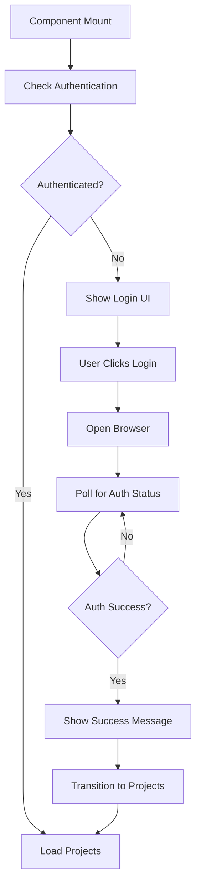

# Adobe Setup Architecture

## Overview

The Adobe Setup step is a comprehensive authentication and configuration component that guides users through selecting their Adobe organization, project, and workspace. It replaces the previous multi-step approach (separate auth, org selection, and project selection steps) with a unified, efficient interface.

## Design Philosophy

### Two-Column Layout
The component uses a distinctive two-column layout that provides:
- **Left Column (60%)**: Active step content with full vertical space
- **Right Column (40%)**: Persistent configuration summary with edit capabilities

This design ensures users always see their current configuration while making selections, reducing cognitive load and providing clear context.

### Progressive Disclosure
The interface reveals complexity gradually:
1. First, handle authentication
2. Then, select from available projects
3. Finally, choose a workspace

Each step builds on the previous, with automatic advancement when appropriate.

## Component Architecture

```
AdobeSetupStep
├── State Management
│   ├── Local State (useState hooks)
│   ├── Wizard State (props)
│   └── Message Handlers (vscode.onMessage)
├── Left Column (Active Step)
│   ├── Authentication Step
│   ├── Project Selection Step
│   └── Workspace Selection Step
└── Right Column (Summary Panel)
    ├── Authentication Status
    ├── Project Selection
    └── Workspace Selection
```

## State Flow

### Authentication Flow


### State Transitions
1. **Initial Load**: Check authentication status immediately
2. **Authentication Success**: 2-second success message, then auto-advance
3. **Project Selection**: Load projects, show with search if >5 items
4. **Workspace Selection**: Load workspaces for selected project

## Message Protocol

### Incoming Messages
- `auth-status`: Authentication state updates
- `projects`: List of available projects
- `workspaces`: List of available workspaces

### Outgoing Messages
- `check-auth`: Request authentication status
- `authenticate`: Initiate login (with force flag for switching)
- `get-projects`: Request projects for organization
- `get-workspaces`: Request workspaces for project
- `select-organization`: Persist org selection
- `select-project`: Persist project selection
- `select-workspace`: Persist workspace selection

## Key Features

### 1. Fast Authentication Feedback
- **Polling Interval**: Reduced from 3s to 1s
- **Result**: 3x faster response after browser authentication
- **Implementation**: Modified polling interval in `createProjectWebview.ts`

### 2. Smart Loading States
```typescript
// Different messages for different contexts
isLoggingIn ? 'Opening browser for authentication...' : 'Checking authentication status...'

// Context-aware loading messages
<Text>Loading your Adobe projects...</Text>
<Text>Fetching from organization: {state.adobeOrg.name}</Text>
```

### 3. Edit Capabilities
- Edit buttons always visible (not hover-only)
- Clicking edit returns to that step
- Clears dependent selections (e.g., workspace when changing project)
- Maintains loading state consistency

### 4. Auto-Selection Logic
- Single project: Auto-select
- Single workspace: Auto-select
- Multiple options: User must choose

## Timing Constants

- **Transition Animation**: 200ms
- **Auth Success Display**: 2000ms
- **Edit Step Delay**: 250ms
- **Polling Interval**: 1000ms (down from 3000ms)

## CSS Architecture

### Inline Styles Approach
The component uses inline styles for maximum control and consistency:

```typescript
// Two-column layout
<div style={{ display: 'flex', height: '100%', width: '100%', gap: '0' }}>
    <div style={{ flex: '1 1 60%', padding: '24px' }}>
        {/* Left column */}
    </div>
    <div style={{ 
        flex: '0 0 40%', 
        padding: '24px',
        backgroundColor: 'var(--spectrum-global-color-gray-75)',
        borderLeft: '1px solid var(--spectrum-global-color-gray-200)'
    }}>
        {/* Right column */}
    </div>
</div>
```

### Key Style Patterns
- **Selection Highlight**: Blue left border (3px) with subtle background
- **Edit Buttons**: Gray color transitioning to blue on hover
- **Ready Status**: Green well with checkmark icon
- **Transitions**: Opacity and transform for smooth step changes

## Error Handling

### Authentication Errors
- Clear error messages displayed
- Retry capabilities built-in
- Loading states cleared appropriately

### Project/Workspace Loading Errors
- Error well with retry button
- Clear error messaging
- Maintains previous selections

## Performance Optimizations

### 1. Immediate Project Loading
Projects start loading during auth success message display:
```typescript
if (data.isAuthenticated && currentStep === 'auth') {
    loadProjects(); // Start immediately
    setTimeout(() => {
        transitionToStep('project'); // Transition after delay
    }, 2000);
}
```

### 2. Memoized Filtering
Project search uses `useMemo` for efficient filtering:
```typescript
const filteredProjects = useMemo(() => {
    if (!projectSearchQuery.trim()) return projects;
    // ... filtering logic
}, [projects, projectSearchQuery]);
```

### 3. Conditional Rendering
Search field only shown when needed (>5 projects)

## Recent UX Improvements (v1.3.0)

### Consistent Auto-Advance Behavior
**Previous Issue**: Project selection auto-advanced but workspace selection required manual Continue  
**Solution**: Workspace selection now auto-advances after 500ms delay  
**Impact**: Consistent, predictable flow through all selection steps

### Authentication Success Display
**Previous Issue**: Success message skipped when already authenticated on initial load  
**Solution**: Added `shouldShowAuthSuccess` flag to ensure 2-second display  
**Impact**: Users always see clear authentication confirmation

### Eliminated Double-Loader
**Previous Issue**: "Loading your projects..." shown in success screen, then another loader  
**Solution**: Removed intermediate loading text from authentication success  
**Impact**: Cleaner transition without redundant loading states

### Improved Status Section
**Previous Issue**: "Ready to proceed" had inconsistent green background styling  
**Solution**: Redesigned to match other sections with consistent styling  
**Impact**: Unified visual design throughout Configuration Summary

## Known Issues and Solutions

### Issue: Projects Not Loading for Authenticated Users
**Problem**: Check for `projects.length === 0` prevented reload  
**Solution**: Always load projects after authentication

### Issue: Old Projects Showing After Org Switch
**Problem**: Projects list not cleared when switching organizations  
**Solution**: Clear all state (projects, workspaces, selections) in `editStep`

### Issue: No Feedback During Org Switch
**Problem**: Loading state not set before transition  
**Solution**: Set loading state BEFORE transitioning to auth step

## Future Improvements

1. **Caching**: Cache projects/workspaces for faster subsequent loads
2. **Pagination**: Handle organizations with many projects
3. **Search Enhancement**: Add fuzzy search or advanced filtering
4. **Offline Support**: Handle network failures gracefully
5. **Accessibility**: Add ARIA labels and keyboard navigation improvements

## Testing Checklist

- [ ] Authentication flow works for new users
- [ ] Switching organizations clears old data
- [ ] Edit buttons function correctly at each step
- [ ] Auto-selection works for single items
- [ ] Search filters projects correctly
- [ ] Loading states show appropriate messages
- [ ] Success message displays for full 2 seconds
- [ ] Polling responds within 1 second of auth
- [ ] Workspace loads after project selection
- [ ] All selections persist for CLI commands