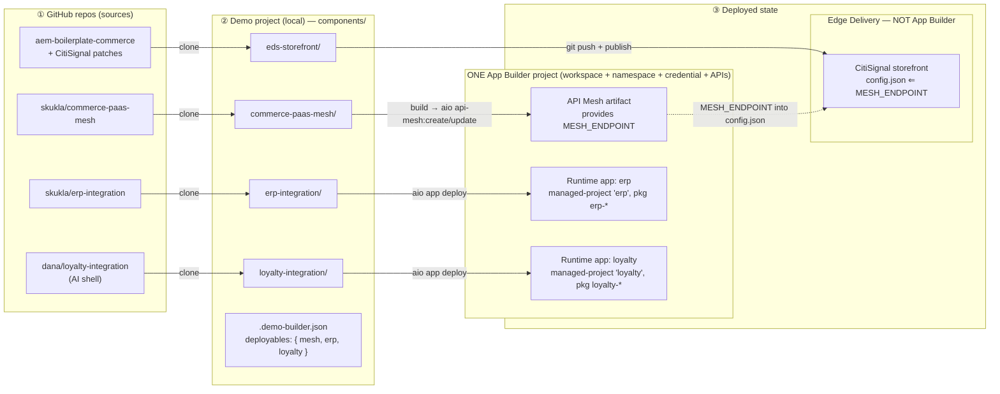

# ADR-011: App Builder Deployables — A Keyed Set of Deployable Components in One App Builder Project (Mesh Is One Kind)

**Status**: Accepted (decision) — not yet implemented; plan at [`.rptc/plans/appbuilder-deployable-model/`](../../../.rptc/plans/appbuilder-deployable-model/overview.md)
**Date**: 2026-06-19
**Decision Maker**: Project Owner
**Implementer**: Pending — D1 spike → D1–D3 (see plan)

Related: [ADR-006 Thin-Layer Storefront Customization](006-thin-layer-storefront-customization.md) (canonical + code-patches; the same "components are cloned sources" model), [ADR-009 Storefront config.json Flag Injection](009-storefront-config-flag-injection.md) (the `MESH_ENDPOINT`→config edge this generalizes). Research: [`.rptc/research/appbuilder-deployable-model/research.md`](../../../.rptc/research/appbuilder-deployable-model/research.md) + [`.rptc/research/app-builder-app-structure/research.md`](../../../.rptc/research/app-builder-app-structure/research.md). **Supersedes** the singular App Builder model shipped as slice 1 (deploy spine).

---

## Context

### The model we are replacing

The "App Builder app" feature (slice 1, on `develop`) modeled a demo's runtime as **two special cases**: a singular API Mesh (`project.meshState`) and at most **one** custom App Builder app (`project.appState`, mirroring `meshState`). Multiple integration domains were to live as multiple packages *inside that one app*. Mesh and app were built as "honest siblings" sharing only `buildComponent`, with a generalized framework deferred until a third deployable type appeared.

Two problems surfaced when designing the curated catalog (the next slice):

1. **The singular app doesn't fit composing *independent* integrations.** A demo builder exists to compose a demo from curated, independently-sourced pieces. "One app, many packages" is the right way to organize *one logical app's* domains — but forcing several independently-maintained integration repos into one codebase means a manifest-merge mechanism and couples their lifecycles (remove one → recompose + redeploy all).

2. **The reframe (Project Owner): "having a mesh" is not a primitive.** A mesh is a **codebase** (the three `skukla/*-mesh` repos are real projects with build scripts), there is an App Builder template for a mesh, and a workspace "has a mesh" only because the **API Mesh API has been subscribed on the App Builder project**. So a mesh is not a separate universe that merely coexists with apps — it is *one kind of thing an App Builder project deploys*. The singular-mesh special case is the exception that shouldn't exist.

### What this forces

If a mesh is just one kind of App Builder deployable, then mesh and integrations are the same category, and the natural shape is a **set** of deployables a demo composes — not two bespoke singletons. That is the decision below.

## Decision

### A demo holds a keyed *set* of deployables; mesh is one kind

Replace the two singletons with one keyed map:

```
project.deployables: Record<id, { kind, status, source, endpoint?/url?, deployedUrls?, sourceHash?, lastDeployed }>
```

- `kind: "mesh" | "integration"`. A **mesh** is a codebase deployed via its own `aio api-mesh` workflow, requires the **API Mesh API** on the workspace, and **provides env vars the storefront consumes** (`MESH_ENDPOINT` → `config.json`). An **integration** is a custom-app codebase deployed via `aio app deploy`; it stands alone and may consume another deployable's provided vars.
- The `MESH_ENDPOINT`→storefront edge generalizes: **any deployable may declare `providesEnvVars`** the storefront (or another deployable) consumes; mesh is simply the first.

### Each deployable is its own component; they all deploy into ONE App Builder project

- Every deployable is its **own cloned component** (`components/<id>/` — its own repo, build, deploy), exactly like the storefront and the mesh today. They are **not** bundled into a single app.
- All App-Builder deployables deploy into **one** App Builder project per demo (Console project + workspace + namespace + S2S credential + subscribed APIs), provisioned **once**. **Component count ≠ project count (always 1).** There is never a separate project for the mesh vs. integrations.
- They coexist safely because each integration carries a **distinct managed-project name + package prefix**, so an `aio app deploy`/`undeploy` prunes only its own entities. This buys **independent add / deploy / remove** (removing one integration undeploys just it) and removes any manifest-merge mechanism.



### Deploy by honoring each deployable's own scripts (the "deploy contract")

Rather than the extension knowing each kind's `aio` commands, a catalog entry **names the deployable's own scripts** and we orchestrate around them. Evidence: the three mesh repos already ship a self-deploying workflow (`build: node scripts/build-mesh.js`, `create: npm run build && aio api-mesh:create`, `update: npm run build && node scripts/update-mesh.js`). The add path is: ensure the project + its `requiredApis` are subscribed → clone → `npm install` → run the deployable's own deploy script **inside `withOrgContext`** (choose `create` vs `update` from state) → read back results (`aio api-mesh:get` / `aio app get-url`). Meshes therefore stay on `aio api-mesh` (honoring their scripts == keeping the api-mesh path), and the live mesh→storefront wiring is not disturbed.

### A declarative catalog of pre-built deployables; three acquisition modes

A new declarative registry (6th config, mirroring `block-libraries.json`) lists pre-built deployables filtered by the chosen backend/frontend. Seed = the three existing meshes reframed as catalog entries (`commerce-paas-mesh` → PaaS, `commerce-eds-mesh` → ACCS/SaaS, `headless-commerce-mesh` → headless). A deployable is acquired three ways: **pre-built** (catalog), **custom URL** (paste a repo), or **AI shell** (scaffold + author).

### Sequencing: unify the model first, migrate the mesh runtime second

Introduce the catalog + keyed state + a `kind`-dispatching add/deploy/remove path while keeping `deployMeshComponent` and the `MESH_ENDPOINT`→`config.json` generation untouched underneath; then migrate mesh state/staleness onto the unified model behind accessors with a one-time `meshState`/`appState` → `deployables` migration. Never big-bang the load-bearing mesh edge.

## Consequences

**Positive**
- One uniform concept (a deployable) replaces two special cases; mesh is subsumed cleanly, matching the platform reality.
- Independent add/deploy/remove — the "pieces on a shelf" UX the demo builder exists for.
- Each deployable is its own component, matching the existing one-repo-one-component model; no manifest-merge.
- The deploy-contract scales to new kinds without the extension hardcoding their commands, and stops us drifting from repo-owned deploy logic.

**Costs / risks**
- **Revises slice 1**: singular `appState`/`meshState` → keyed `deployables` (a deliberate, tested course-correction, not a rewrite).
- **API subscription becomes critical path**: "add a mesh" needs the API Mesh API subscribed; today only the bare S2S credential is created (`subscribeCredentialToServices` is unbuilt). Generalizes to each deployable's `requiredApis`.
- **Env-var inputs + secrets for arbitrary integrations is real new work**: catalog entries must bring their own env schema, with a generic collection surface; integration credentials need masked input + VS Code SecretStorage (never committed — the repo is public). The `.env`-generation plumbing (`generateComponentEnvFile`) is reusable.
- **UI/UX is a genuine design pass**: the dashboard moves from two singular surfaces to a deployables *list*; the wizard gains a "pick your deployables" step.
- `overview.md` continues to describe the singular model and is updated only when D1–D3 ship.

**Load-bearing assumption (the D1 spike must verify before building on it)**: an integration's `aio app deploy`/`undeploy` only touches its **own** managed-project entities — never the mesh or other integrations — and a per-integration package prefix prevents collisions. This is standard OpenWhisk managed-project behavior but was deferred as a live probe by slice 1.

## Alternatives considered

- **Model A — keep the singular app + singular mesh (slice 1 as shipped).** Rejected: doesn't express composing independent integrations, and leaves the mesh a permanent special case rather than subsuming it.
- **Bundle integrations into one multi-package app.** Rejected: couples integration lifecycles and requires a manifest-merge mechanism. Distinct managed-project names make multiple independent apps in one workspace safe, so the bundling buys nothing. (Adobe's "one multi-package app" guidance is about one logical app's domains, not a ban on multiple apps in a workspace.)
- **Move meshes to `aio app deploy` (unify the deploy verb).** Deferred: the mesh repos deploy via their own `aio api-mesh` scripts, and routing the live mesh through `app deploy` is a bigger, riskier change to the load-bearing mesh→storefront path. The model/catalog/UX unify now; the deploy verb stays per-kind.
